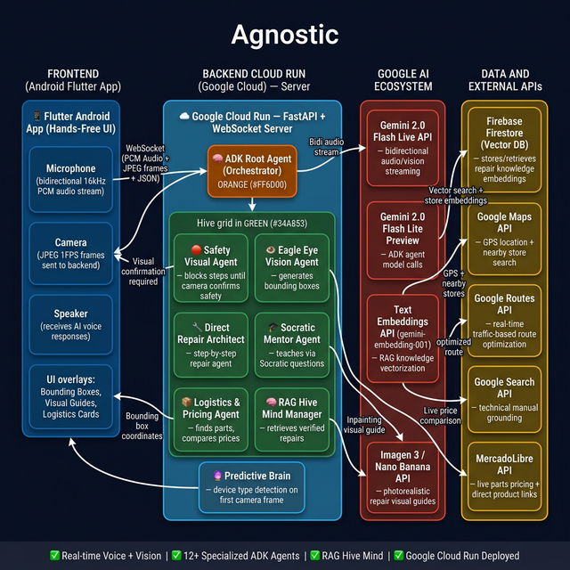

# Agnostic — AI Live Agent for Field Technicians 🛠️

> *"What today lives in a smartphone, tomorrow will live in smart glasses."*

An AI-powered, **hands-free** repair assistant that uses **Gemini Live API**, **ADK multi-agent orchestration**, and real-time vision to guide field technicians and DIY hobbyists. Agnostic sees what you see, hears what you say, and speaks back in real time — **zero typing required**.

Built for the [Gemini Live Agent Challenge](https://geminiliveagentchallenge.devpost.com/) — Category: **Live Agents 🗣️**

---

## 🌐 Architecture

Backend hosted on **Google Cloud Run** — 100% serverless, scalable, and always-on.

- **12+ ADK specialized agents** orchestrated by a Root Agent
- **Gemini Live API** for real-time bidirectional audio streaming (16kHz PCM)
- **Imagen 3** for generative visual guides (inpainting) overlaid on the camera feed
- **RAG Hive Mind** — verified repairs stored as vector embeddings in Firestore
- **Flutter (Android)** for the fully reactive, hands-free UI



---

## 🚀 Quick Start (Spin-up Instructions for Judges)

### Prerequisites

- Python 3.11+
- Flutter 3.x SDK
- Google Cloud account with billing enabled
- API Keys: Gemini, Google Maps

### 1. Clone the repository

```bash
git clone https://github.com/YOUR_USERNAME/agnostic-live-agent.git
cd agnostic-live-agent
```

### 2. Configure environment variables

```bash
cd backend
cp .env.example .env
# Edit .env and fill in your API keys
```

Your `.env` should contain:
```
GEMINI_API_KEY=your_gemini_api_key_here
GOOGLE_MAPS_API_KEY=your_maps_api_key_here
GOOGLE_API_KEY=your_gemini_api_key_here
GCP_PROJECT=your_gcp_project_id
```

### 3. Deploy the backend to Google Cloud Run

```bash
cd backend
gcloud run deploy agnostic-backend \
  --source . \
  --region us-central1 \
  --allow-unauthenticated \
  --set-env-vars GEMINI_API_KEY=$GEMINI_API_KEY,GOOGLE_MAPS_API_KEY=$GOOGLE_MAPS_API_KEY
```

Or run locally for testing:

```bash
pip install -r requirements.txt
uvicorn main:app --reload --port 8080
```

### 4. Build and install the Flutter app

```bash
cd frontend/agnostic_app

# Update the backend URL in lib/main.dart:
# static const String _backendUrl = 'YOUR_CLOUD_RUN_URL';

flutter pub get
flutter build apk --release
# Install on Android device:
adb install build/app/outputs/flutter-apk/app-release.apk
```

## 🧪 Testing Guide — How to Test Agnostic

### 📱 App Modes — What to Know Before Testing

Agnostic has two main modes selectable from the UI:

| Mode | Who it's for | What it does |
|------|-------------|--------------|
| **Residencial (Residential)** | Professional technicians | Gets straight to the fix with no explanations. Maximum speed. |
| **Hogar (Home)** | Hobbyists & beginners | Two sub-modes available: see below. |

**Hogar sub-modes (selectable by voice or intent):**
- 🔧 **Reparación Directa** — Step-by-step repair instructions, fast and actionable, but adapted for non-experts.
- 🎓 **Modo Aprendizaje (Socratic Mode)** — Agnostic doesn't give the answer directly. Instead, it asks guiding questions to help you understand *why* each step is done, teaching as it helps.

---

### Test 1 — 🔧 Residencial vs. Hogar (Mode Comparison)
**Goal:** Verify the behavior difference between the two modes.

1. Select **"Residencial"** mode. Point the camera at a fan. Say: _"El capacitor no arranca el motor."_
   - **Expected:** Direct diagnosis and fix steps. Zero explanations, maximum speed.
2. Switch to **"Hogar"** mode. Repeat the same question.
   - **Expected:** Agnostic asks: _"¿Cuándo fue la última vez que lo usaste?"_ or _"¿Escuchás algún zumbido?"_ — leading you to understand the root cause.

---

### Test 2 — 🎓 Socratic Learning Mode
1. Select **"Hogar"** mode and activate **Modo Aprendizaje** (say: _"Quiero aprender mientras reparo"_).
2. Point the camera at an outlet with disconnected wires.
3. Say: _"No sé cómo conectar estos cables."_
4. **Expected:** Agnostic asks questions like _"¿Cuántos cables ves? ¿Podés identificar los colores?"_ — never directly giving the answer until you demonstrate understanding.

---

### Test 3 — 🛑 Mandatory Safety Gate
1. Point the camera at exposed wires with a connected device visible.
2. Say: _"Voy a empezar la reparación."_
3. **Expected:** Agnostic **blocks all progress** and demands you show the circuit breaker in the OFF position through the camera before it proceeds. The Safety Agent must visually confirm the OFF state — verbal confirmation alone is NOT enough.

---

### Test 4 — 👁️ Visual Bounding Box (Eagle Eye Agent)
1. Point the camera at any device with multiple components.
2. Say: _"¿Dónde está el capacitor?"_ or _"Marcame los cables."_
3. **Expected:** Within 2-3 seconds, a green labeled rectangle appears drawn directly over the correct component on your camera feed — no interruption to the voice conversation.

---

### Test 5 — 🖼️ Generative Visual Guide (Imagen 3 via Nano Banana)
1. Point the camera at an outlet or switch with disconnected cables.
2. Say: _"Generá una guía visual de cómo van los cables."_
3. **Expected:** Within ~10 seconds, a photorealistic generated image appears in the app showing cables drawn into the exact correct terminals, using your real camera frame as the base.

---

### Test 6 — 📦 Live Logistics Engine (Full Flow)
**Goal:** Verify the complete parts-sourcing intelligence.

**This is what happens when you say "I need a spare part":**

1. Point the camera at a broken component and say: _"El capacitor del ventilador está roto. ¿Dónde lo consigo?"_

2. **Step A — Nearby Store Search:**
   - Agnostic uses your **real GPS location** (captured on app start) to search Google Maps for nearby electronics / spare parts stores.
   - It visits those stores' websites to search for the specific part's current price.

3. **Step B — Traffic-Optimized Route:**
   - Agnostic uses **Google Routes API** to calculate traffic conditions in real time.
   - It recommends **the store with the shortest travel time** (not just the closest in distance) based on current traffic.

4. **Step C — MercadoLibre Price Comparison:**
   - In parallel, it searches MercadoLibre for the same part.
   - **Expected screen result:** A tappable overlay card appears with **both options side by side**: the local store price + estimated travel time, versus the MercadoLibre online price + delivery time. The technician decides.

5. **Expected backend logs:** `[RAG] Logística: 3 locales encontrados`, `[ML] Link directo extraído: https://mercadolibre.com/...`

---

### Test 7 — 🧠 Hive Mind (RAG Collective Knowledge)
1. Describe a common repair: _"El lavarropas no calienta el agua bien."_
2. **Expected:** Agnostic answers citing a **specific past repair** performed by another technician, not a generic model answer. Check backend logs for: `[RAG] Experiencia similar encontrada (score: 0.82)`.

---

### Test 8 — 🔦 Flashlight Control
1. Say: _"Enciende la linterna."_ → LED turns on immediately.
2. Say: _"Apaga la linterna."_ → LED turns off.

---

## 🧠 Key Features

| Feature | Description |
|---------|-------------|
| **Real-time Voice Interaction** | Bidirectional audio via Gemini Live API. Barge-in supported. |
| **Live Camera Vision** | 1 FPS frame streaming. Gemini sees what you see. |
| **Visual Bounding Boxes** | ADK Vision Precision agent draws labels directly on the camera view. |
| **Generative Visual Guides** | Imagen 3 generates annotated repair diagrams overlaid on your camera feed. |
| **Mandatory Safety Gate** | Visual safety check blocks the next step until safe conditions are confirmed. |
| **Live Logistics** | Finds replacement parts and pushes MercadoLibre links to screen via WebSocket. |
| **Socratic Learning Mode** | Teaches hobbyists through questions instead of just giving answers. |
| **RAG Hive Mind** | Collective intelligence from verified real-world repairs — eliminates hallucinations. |
| **Flashlight Control** | Voice-activated LED torch for dark work environments. |

---

## 🛠️ Built With

- `google-gemini` / `gemini-2.0-flash-live`
- `agent-development-kit` (ADK)
- `google-genai-sdk`
- `imagen-3` / `nano-banana`
- `google-cloud-run`
- `firebase` / `cloud-firestore`
- `python` / `fastapi` / `websockets`
- `flutter` / `dart`
- `text-embeddings` / `rag` / `vector-database`
- `google-search` (grounding)
- `mercadolibre-api`

---

## 📁 Project Structure

```
agnostic/
├── backend/                    # Python FastAPI backend (Cloud Run)
│   ├── main.py                 # WebSocket server + Gemini Live integration
│   ├── prompts.py              # System prompts per mode
│   ├── adk_agents.py           # Root agent + repair specialists
│   ├── adk_universal_mentor.py # Socratic learning agent
│   ├── adk_vision_precision.py # Bounding box precision agent
│   ├── adk_direct_repair.py    # Direct repair agent
│   ├── adk_logistica.py        # Logistics + parts search agent
│   ├── rag_knowledge_base.py   # Hive Mind RAG system
│   ├── Dockerfile
│   ├── requirements.txt
│   └── .env.example
├── frontend/
│   └── agnostic_app/           # Flutter Android app
│       └── lib/
│           ├── main.dart       # Main UI + WebSocket client
│           └── gemini_direct_service.dart  # Direct Gemini Live client
└── mcp-server/                 # MCP server for tools (Maps, etc.)
```

---

## 📹 Demo Video

[Watch the demo on YouTube → ](#) *(coming soon)*

---

## 🏆 Gemini Live Agent Challenge

This project was built for the **Gemini Live Agent Challenge** — Category: **Live Agents 🗣️**

- ✅ Uses Gemini Live API for real-time audio/vision
- ✅ Built with ADK (Agent Development Kit)
- ✅ Backend hosted on Google Cloud Run
- ✅ Multimodal: audio + vision + generative image output

---

## ⚠️ Security Notice

**Never commit your `.env` file.** All API keys must be provided as environment variables. See `.env.example` for the required variable names.

---

*Agnostic: The bridge between Artificial Intelligence and Manual Labor.*
